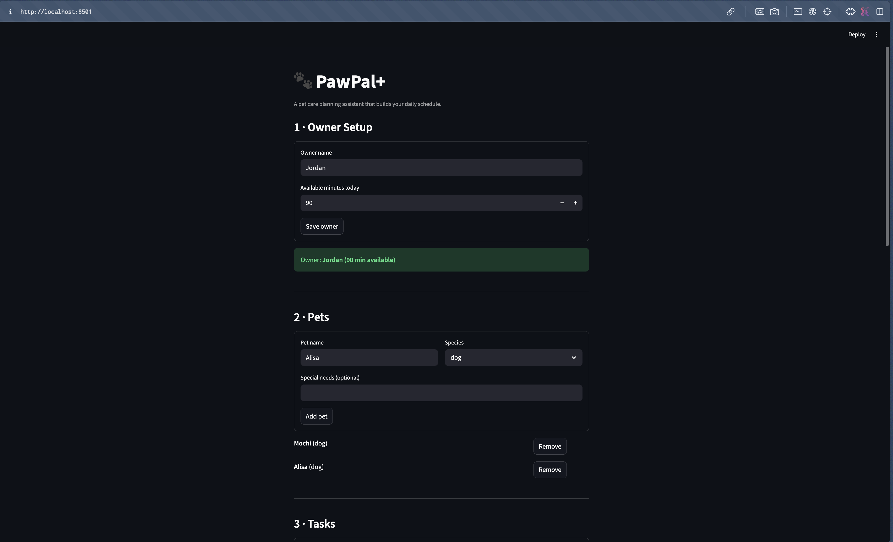

# PawPal+ (Module 2 Project)

**PawPal+** is a Streamlit-powered pet care planning assistant that helps busy pet owners organise daily care tasks across multiple pets. It combines priority-based scheduling, preferred-time sorting, conflict detection, and automatic task recurrence into one clean interface.

## Demo



## Features

### Scheduling Algorithms

- **Time-aware sorting** — Tasks with a preferred time (`HH:MM`) are sorted chronologically using a lambda key that splits the string into an `(hour, minute)` tuple. Tasks without a preferred time are placed at the end.
- **Greedy time-budget packing** — The scheduler collects all pending tasks, sorts them by preferred time, then priority (high first), then duration (shorter first), and greedily packs them into the owner's available minutes. Tasks that don't fit are reported as skipped.
- **Conflict detection** — Before finalising a schedule, every pair of timed tasks is checked for overlapping windows using the interval condition `start_a < end_b and start_b < end_a`. Conflicts produce warning messages instead of crashes.

### Task Management

- **Daily recurrence** — When a daily or weekly task is marked complete, `Pet.complete_task()` automatically replaces it with a fresh pending copy via `Task.next_occurrence()`. The owner never has to re-enter recurring tasks.
- **As-needed tasks** — Tasks with `frequency="as_needed"` stay done when completed and don't regenerate.
- **Input validation** — `Task.__post_init__()` rejects invalid priorities, non-positive durations, unknown frequencies, and malformed `HH:MM` times at creation time.

### Multi-Pet Support

- **Unified cross-pet scheduling** — The `Scheduler` aggregates tasks from all of an owner's pets into a single daily plan, labelling each entry with the pet it belongs to.
- **Per-pet task views** — Each pet's tasks are displayed in their own table with status, duration, priority, category, and frequency.
- **Completion tracking** — `Pet.completion_summary()` shows progress like "Mochi: 2/5 tasks complete".

### Streamlit UI

- **Session-state persistence** — `Owner`, `Scheduler`, and schedule results are stored in `st.session_state` so data survives Streamlit's top-to-bottom reruns.
- **Sorted task overview** — A dedicated section shows all pending tasks sorted by preferred time using `Scheduler.sort_by_time()`.
- **Inline conflict warnings** — `st.warning()` and `st.error()` display overlap alerts with plain-English guidance for the owner.
- **Schedule progress bar** — `st.progress()` shows how much of the time budget is used.
- **Skipped tasks** — Tasks that didn't fit the budget are shown in a collapsible expander.

## Testing PawPal+

### Running the tests

```bash
source .venv/bin/activate
python -m pytest tests/test_pawpal.py -v
```

### What the tests cover

The test suite contains **23 tests** across five areas:

| Test class              | Tests | What it verifies                                                                                                                                   |
| ----------------------- | ----- | -------------------------------------------------------------------------------------------------------------------------------------------------- |
| `TestTaskCompletion`    | 4     | `mark_complete()` and `reset()` toggle status correctly; idempotent calls are safe                                                                 |
| `TestPetTaskAddition`   | 4     | Adding tasks increases the count; duplicate titles are rejected without side effects                                                               |
| `TestSortByTime`        | 4     | Tasks sort in chronological `HH:MM` order; untimed tasks come last; `generate_schedule()` respects time-then-priority ordering                     |
| `TestRecurrence`        | 6     | Daily/weekly tasks auto-renew on completion; `as_needed` tasks stay done; renewed tasks preserve all attributes; double-complete doesn't duplicate |
| `TestConflictDetection` | 5     | Overlapping times flagged (same pet and cross-pet); adjacent non-overlapping times pass cleanly; three-way overlap produces exactly 3 warnings     |

### Confidence level

**Rating: 4 / 5**

The core scheduling logic, sorting algorithm, recurrence lifecycle, and conflict detection are all well-covered. The main gaps that would push this to 5 stars are: testing the Streamlit UI integration end-to-end, testing the overnight time boundary (`23:50` wrapping past midnight), and stress-testing with a large number of tasks to verify performance.

## Project Structure

```
pawpal-starter/
├── app.py                 # Streamlit UI
├── pawpal_system.py       # Core classes (Task, Pet, Owner, Scheduler)
├── main.py                # Terminal demo script
├── tests/
│   └── test_pawpal.py     # 23 pytest tests
├── uml.md                 # Final Mermaid class diagram
├── uml_final.png          # Rendered UML image
├── reflection.md          # Design reflection
├── requirements.txt       # Dependencies (streamlit, pytest)
└── README.md              # This file
```

## Getting Started

### Setup

```bash
python -m venv .venv
source .venv/bin/activate  # Windows: .venv\Scripts\activate
pip install -r requirements.txt
```

### Run the Streamlit app

```bash
streamlit run app.py
```

### Run the terminal demo

```bash
python main.py
```
