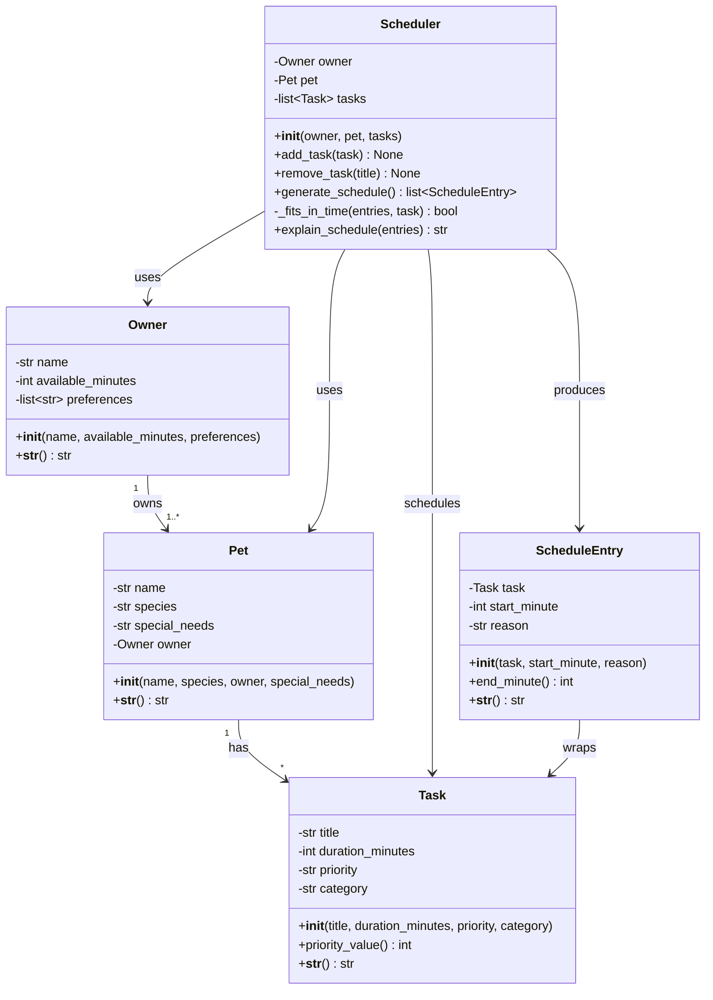

# PawPal+ UML Class Diagram

```mermaid
classDiagram
    class Owner {
        -str name
        -int available_minutes
        -list~str~ preferences
        +__init__(name, available_minutes, preferences)
        +__str__() str
    }

    class Pet {
        -str name
        -str species
        -str special_needs
        -Owner owner
        +__init__(name, species, owner, special_needs)
        +__str__() str
    }

    class Task {
        -str title
        -int duration_minutes
        -str priority
        -str category
        +__init__(title, duration_minutes, priority, category)
        +priority_value() int
        +__str__() str
    }

    class ScheduleEntry {
        -Task task
        -int start_minute
        -str reason
        +__init__(task, start_minute, reason)
        +end_minute() int
        +__str__() str
    }

    class Scheduler {
        -Owner owner
        -Pet pet
        -list~Task~ tasks
        +__init__(owner, pet, tasks)
        +add_task(task) None
        +remove_task(title) None
        +generate_schedule() list~ScheduleEntry~
        -_fits_in_time(entries, task) bool
        +explain_schedule(entries) str
    }

    Owner "1" --> "1..*" Pet : owns
    Pet "1" --> "*" Task : has
    Scheduler --> Owner : uses
    Scheduler --> Pet : uses
    Scheduler --> Task : schedules
    Scheduler --> ScheduleEntry : produces
    ScheduleEntry --> Task : wraps
```
